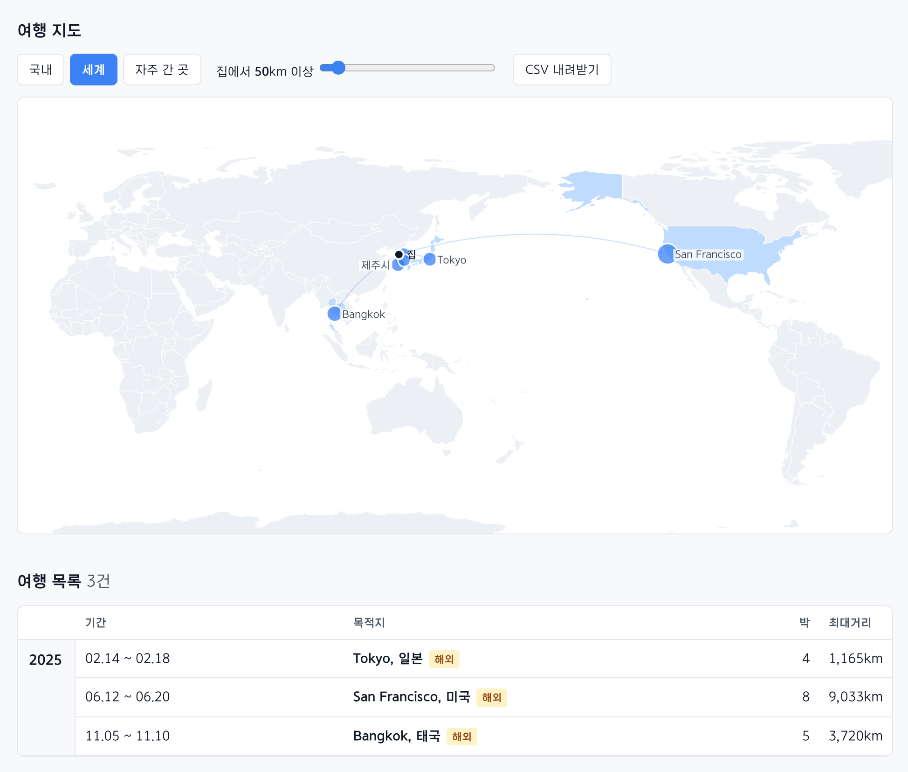

# 여행 타임라인

Google Timeline에서 내보낸 `location-history.json`을 읽어, 집에서 멀리 벗어난 기간을 여행으로 정리해 주는 작은 정적 웹페이지입니다. 여행 목록과 지도에서 이동 기록을 한눈에 볼 수 있습니다.



파일은 브라우저 안에서만 처리합니다. 업로드하거나 서버에 저장하지 않습니다. 지명은 프로젝트에 포함된 경계와 도시 데이터로 찾습니다.

외부로 나가는 요청은 배경 지도 타일 하나뿐입니다. 여행 상세와 자주 간 곳 지도는 CARTO에서 타일을 받아오며, 이때 보고 있는 지역의 타일 좌표가 그 서버에 전달됩니다. 위치 기록 파일 자체는 어느 경우에도 브라우저 밖으로 나가지 않습니다.

## 바로 쓰기

### **https://taekie.github.io/timeline-trips/**

설치 없이 위 주소를 열고 `location-history.json`을 끌어다 놓으면 됩니다. 네트워크를 통해 내려받는 것은 페이지와 경계 데이터뿐이며, 위치 기록 파일 자체는 브라우저 밖으로 나가지 않습니다.

내보내기 메뉴는 기기마다 다릅니다.

- **iPhone** — Google 지도 앱 → 프로필 → ⋯ → 위치 및 개인정보 설정 → 타임라인 데이터 내보내기 → 파일에 저장 (`location-history.json`)
- **Android** — 휴대폰 **설정** → 위치 → 타임라인 → 타임라인 데이터 내보내기 (`Timeline.json`)

기록 파일이 없어도 **샘플 데이터로 둘러보기** 버튼을 눌러 가상의 2년치 기록을 살펴볼 수 있습니다. 영문판은 [/en/](https://taekie.github.io/timeline-trips/en/)에 있습니다.

## 직접 띄우기

고치면서 쓰려면 프로젝트 폴더에서 웹 서버를 실행하세요. 브라우저 보안 정책상 `file://`로는 데이터 파일을 불러올 수 없습니다.

```sh
python3 -m http.server 8000
```

그다음 `http://localhost:8000`을 엽니다.

## 작동 방식

### 집 찾기

`Home`으로 분류된 체류 기록을 우선 사용합니다. 날짜별로 앞뒤 60일의 기록을 함께 보고, 가장 오래 머문 1km 격자의 중심을 그 시점의 집으로 잡습니다. 이사한 경우에도 반영할 수 있도록 기준점을 시기별로 따로 정합니다.

`Home` 라벨이 충분하지 않으면 현지 시각 새벽 3시를 포함하는 체류 기록으로 집을 추정합니다.

### 여행 묶기

하루 중 집에서 가장 멀리 떨어진 거리가 기준을 넘는 날을 여행 후보로 봅니다. 기본 기준은 일별 최대거리의 90분위에 4를 곱한 값이며, 50~150km 범위에서 정합니다. 화면의 슬라이더로 바꿀 수 있습니다.

중간에 기록이 비어 있어도 2일 이내면 같은 여행으로 연결합니다. 6일 이내의 공백은 앞뒤 두 구간의 목적지가 서로 300km 이내일 때만 이어 붙입니다.

다만 사이에 **집에서 잔 밤**이 있으면 거기서 끊습니다. 여행이 끝났다는 신호는 낮에 얼마나 멀리 갔느냐가 아니라 그 밤을 집에서 잤느냐이기 때문입니다. 이 판정이 없으면 기준 거리를 낮출수록 집 앞 나들이가 빈틈을 메워, 집에 들렀다 다시 떠난 별개 여행이 하나로 붙습니다.

### 자주 간 곳

기준 거리와 무관하게, 반복해서 들른 곳을 따로 셉니다. 묶는 단위는 구글이 붙인 `placeID`입니다. 행정구역으로 묶으면 장소 범위가 지나치게 넓어지고, 좌표 격자로 묶으면 같은 건물도 나뉠 수 있기 때문입니다.

한 번에 30분을 넘겼으면 **방문**, 그 아래면 **경유**로 나눕니다. 신호등에 걸린 사거리가 단골 가게보다 위에 표시되지 않게 하기 위해서입니다. 장소를 누르면 그곳에 간 날의 이동 경로가 **갈 때**(파랑)와 **올 때**(주황)로 나뉘어 표시됩니다.

### 장소 이름

국내는 행정경계로 시·군·구를 찾고, 해외는 가까운 도시 이름을 우선 사용합니다. 단순 최근접 도시 대신 인구를 함께 반영해, 큰 도시의 동네 이름이 목적지로 표시되는 경우를 줄였습니다. 해안이나 해상 좌표는 도시보다 행정경계를 먼저 확인합니다.

## 데이터 구성

```
index.html         앱 전체 (파싱, 집·여행 판정, 지명, 지도)
geo.json           국가 외곽선 177개, 세계 도시 11,337개, 지역 파일 목록
regions/           국가별 행정경계 236개국
sample.json        기록이 없어도 둘러볼 수 있는 가상 2년치 기록
prep.py            geo.json·regions 빌드
make_sample.py     sample.json 빌드
i18n/              문구 사전과 다른 말로 찍는 도구
test.js            테스트
```

지명은 한글과 영문으로 함께 들어 있습니다 — `[한글, 영문, 경계 좌표, 국가 코드]`. 영문판은 배포할 때 `i18n/apply.py`로 생성합니다.

처음에는 `geo.json`만 불러옵니다(gzip 약 230KB). 분석으로 방문 국가를 확인한 뒤에는 해당 국가의 `regions/<국가코드>.json`만 추가로 불러옵니다. 예를 들어 한국만 방문했다면 `regions/KR.json`만 로드됩니다.

## 알려진 한계

- 위치 기록이 드문 기간의 여행은 놓칠 수 있습니다. 화면 상단의 기록 밀도 표시를 참고하세요.
- 이전 Takeout 형식인 `timelineObjects`와 원시 `Records.json` 형식은 아직 지원하지 않습니다.
- 하루 안에 다녀온 먼 정기 방문(예: 본가)도 여행으로 분류될 수 있습니다.
- 해외 행정경계는 주·도(admin-1) 단위입니다. 특정 국가의 더 세밀한 경계가 필요하면 `regions/<국가코드>.json`을 해당 국가의 오픈데이터로 교체할 수 있습니다.
- 상세 지도의 배경 타일은 CARTO 무료 사용에 기대고 있어, 제공자 사정에 따라 나오지 않을 수 있습니다. 이때는 배경 없이 경로만 표시됩니다.
- 배경 타일의 글자는 제공자가 현지 이름으로 주므로, 영문판에서도 지도 위 도로명은 현지어로 나옵니다.

## 데이터 출처

- 한국 시·군·구: [southkorea/southkorea-maps](https://github.com/southkorea/southkorea-maps) — KOSTAT 2018 (한글·영문 지명 포함)
- 국가 경계·한글/영문 국가명: [Natural Earth](https://github.com/nvkelso/natural-earth-vector) 110m/50m
- 세계 주·도 경계: Natural Earth 10m admin-1 (4,596개 지역)
- 세계 도시: [GeoNames cities15000](https://download.geonames.org/export/dump/)

## 테스트

```sh
node test.js
```

좌표 픽스처만으로 지명 처리와 기본 판정을 테스트합니다. 개인 내보내기 파일을 `lh.json`으로 심볼릭 링크하면 집·여행 판정까지 함께 확인합니다. `lh.json`은 `.gitignore`에 포함되어 있습니다.
